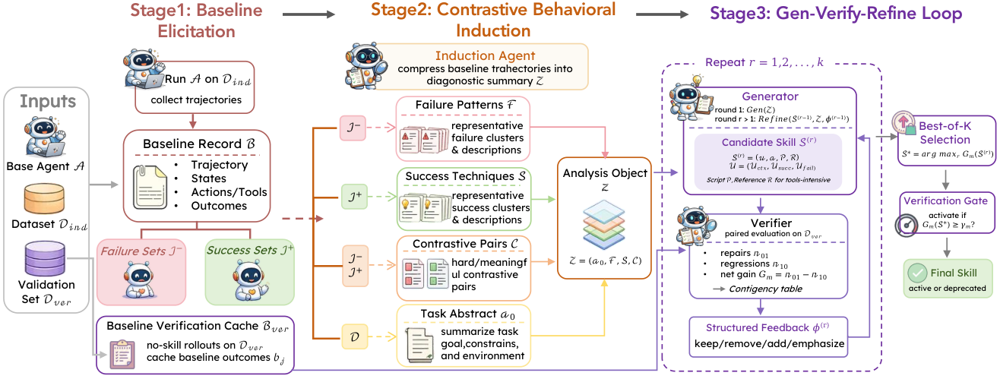
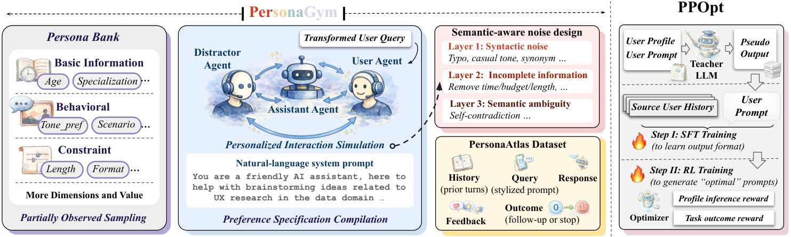
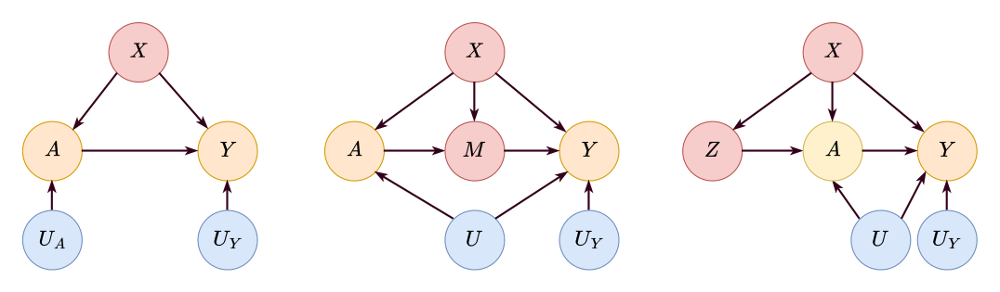
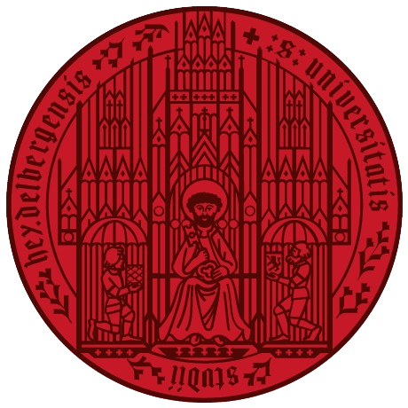
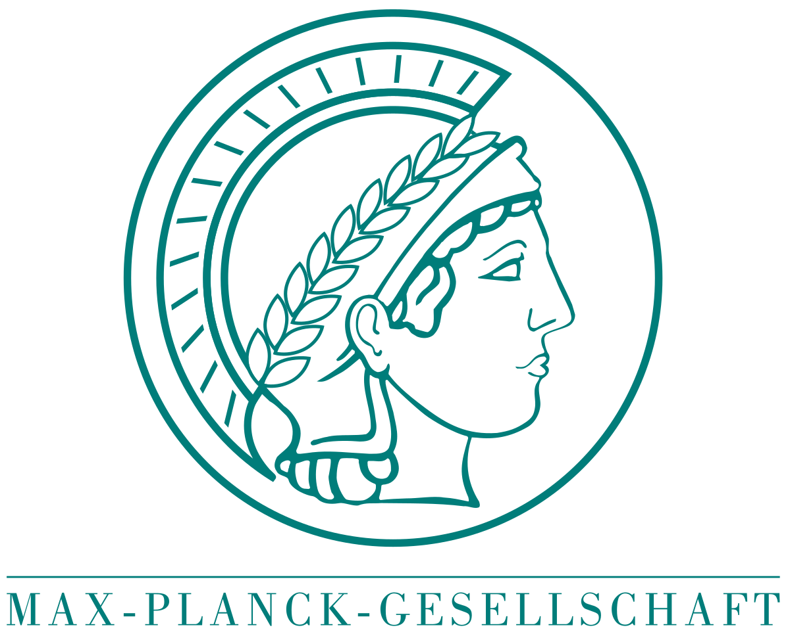

<section class="hero" id="about">
  

    

      <h1 class="hero-title">Yuchen Ma 马羽宸</h1>
      
I am a Ph.D. student in Computer Science at <a href="https://www.lmu.de/en/">LMU Munich</a>, supervised by <a href="https://scholar.google.com/citations?user=TtgGRnEAAAAJ&hl=de">Prof. Stefan Feuerriegel</a>. Currently, I am a research intern at <a href="https://www.microsoft.com/en-us/research/">Microsoft Research</a>, working with Swadheen Shukla and Michel Galley.

      
My research interests are in agentic AI, large language models, and causal inference. I'm happy to <a href="mailto:yuchen.ma@lmu.de">connect and discuss potential collaborations</a>.

    

    

      
      

        <a href="mailto:yuchen.ma@lmu.de" aria-label="Email" title="Email"><svg class="hl-icon" viewBox="0 0 24 24" aria-hidden="true"><path d="M3 5h18a1 1 0 0 1 1 1v12a1 1 0 0 1-1 1H3a1 1 0 0 1-1-1V6a1 1 0 0 1 1-1Zm1 2.4V18h16V7.4l-8 5.4-8-5.4Zm.7-.4 7.3 4.95L19.3 7H4.7Z"/></svg></a>
        <a href="{{site.google_scholar}}" aria-label="Google Scholar" title="Google Scholar"><svg class="hl-icon" viewBox="0 0 24 24" aria-hidden="true"><path d="M12 2 1 9l4 2.55V16l7 4.5L19 16v-4.45l3-1.9V16h2V9L12 2Zm0 2.27L20.27 9 12 14.27 3.73 9 12 4.27ZM7 13.18l5 3.32 5-3.32V14.6l-5 3.2-5-3.2v-1.42Z"/></svg></a>
        <a href="{{ site.github_link }}" aria-label="GitHub" title="GitHub"><svg class="hl-icon" viewBox="0 0 24 24" aria-hidden="true"><path d="M12 2C6.48 2 2 6.58 2 12.25c0 4.53 2.87 8.37 6.84 9.73.5.1.68-.22.68-.49 0-.24-.01-.88-.01-1.72-2.78.62-3.37-1.36-3.37-1.36-.45-1.18-1.11-1.49-1.11-1.49-.91-.63.07-.62.07-.62 1 .07 1.53 1.05 1.53 1.05.89 1.56 2.34 1.11 2.91.85.09-.66.35-1.11.63-1.37-2.22-.26-4.55-1.13-4.55-5.04 0-1.11.39-2.02 1.03-2.74-.1-.26-.45-1.3.1-2.71 0 0 .84-.27 2.75 1.05A9.4 9.4 0 0 1 12 6.84c.85.004 1.71.12 2.51.34 1.91-1.32 2.75-1.05 2.75-1.05.55 1.41.2 2.45.1 2.71.64.72 1.03 1.63 1.03 2.74 0 3.92-2.34 4.78-4.57 5.03.36.32.68.94.68 1.9 0 1.37-.01 2.48-.01 2.81 0 .27.18.6.69.49C19.13 20.62 22 16.78 22 12.25 22 6.58 17.52 2 12 2Z"/></svg></a>
        <a href="{{ site.linkedin }}" aria-label="LinkedIn" title="LinkedIn"><svg class="hl-icon" viewBox="0 0 24 24" aria-hidden="true"><path d="M4.98 3.5a2.5 2.5 0 1 1 0 5 2.5 2.5 0 0 1 0-5ZM3 9.5h4v11H3v-11Zm6.5 0H13v1.6h.05c.5-.95 1.73-1.95 3.55-1.95 3.8 0 4.5 2.5 4.5 5.7V20.5h-4V15.4c0-1.22-.02-2.8-1.7-2.8-1.7 0-1.96 1.33-1.96 2.7V20.5h-4v-11Z"/></svg></a>
        <a href="https://x.com/Yuchen_yccm" aria-label="X" title="X"><svg class="hl-icon" viewBox="0 0 24 24" aria-hidden="true"><path d="M18.244 2.25h3.308L14.32 10.51l8.52 11.24h-6.673l-5.21-6.83-5.96 6.83H1.69l7.71-8.83L1.25 2.25h6.84l4.71 6.23 5.444-6.23Zm-1.16 17.52h1.83L7.07 4.13H5.13l11.954 15.64Z"/></svg></a>
      

    

  

</section>

<section class="section" id="news">
<h2 class="section-h">News</h2>

  

    Jun 2026
    Joining <strong>Microsoft Research</strong> as a research intern this summer. I'll be in Seattle this summer, happy to meet for a coffee chat!
  

  

    May 2026
    Research stay at <strong>University of Notre Dame</strong> (May – Jun 2026).
  

  

    May 2026
    <a href="https://arxiv.org/abs/2602.12394">One paper</a> accepted at <strong>KDD 2026</strong>. See you in Jeju!
  

  

    May 2026
    <a href="https://arxiv.org/abs/2602.12966">One paper</a> accepted at <strong>ICML 2026</strong>. See you in Seoul!
  

  

    Apr 2026
    Organizing the <a href="https://kdd26-relscifm.github.io/"><strong>RelSciFM @ KDD 2026</strong></a> workshop on Reliable Scientific Foundation Models.
  

  

    Jan 2026
    <a href="https://arxiv.org/abs/2506.10914">One paper</a> accepted at <strong>ICLR 2026</strong>. See you in Rio de Janeiro!
  

  

    Jan 2026
    Released the <strong>CausalFM toolkit</strong> — <a href="https://causalfm-toolkit.readthedocs.io/en/latest/">docs</a>.
  

  

    Sep 2025
    <a href="https://arxiv.org/abs/2507.02843">One paper</a> accepted at <strong>NeurIPS 2025</strong>. See you in San Diego!
  

  

    May 2025
    <a href="https://arxiv.org/abs/2506.01533">One paper</a> accepted at <strong>KDD 2025</strong>. See you in Toronto!
  

  

    Sep 2024
    <a href="https://arxiv.org/abs/2410.08924">One paper</a> accepted at <strong>NeurIPS 2024</strong>. See you in Vancouver!
  

  <button class="news-toggle" type="button">Show all news</button>

</section>

<section class="section" id="projects">
<h2 class="section-h">Selected Projects</h2>

  

    
  

  

    <h3 class="project-title">Agent Skill Synthesis</h3>
    
<em>We study how LLM agents can distill their own experience into reusable, verified skills that improve capabilities without retraining.</em>

    
<strong>Highlights:</strong>

    <ul>
      <li>
        
<a href="https://arxiv.org/abs/2605.10999" target="_blank" rel="noopener noreferrer">SkillGen: Verified Inference-Time Agent Skill Synthesis</a>, <em>Preprint</em> &nbsp;(💻 <a href="https://github.com/yccm/SkillGen" target="_blank" rel="noopener noreferrer">Code</a>)

      </li>
    </ul>
  

  

    
  

  

    <h3 class="project-title">Personalized LLMs</h3>
    
<em>We develop scalable approaches for adapting LLMs to individual users' preferences and latent constraints.</em>

    
<strong>Highlights:</strong>

    <ul>
      <li>
        
<a href="https://arxiv.org/abs/2602.12394" target="_blank" rel="noopener noreferrer">Synthetic Interaction Data for Scalable Personalization in Large Language Models</a>, <em>In KDD 2026</em> &nbsp;(💻 <a href="https://github.com/yccm/LLM-PPOpt" target="_blank" rel="noopener noreferrer">Code</a>)

      </li>
    </ul>
  

  

    
  

  

    <h3 class="project-title">Causal Foundation Models</h3>
    
<em>We build foundation models that perform causal inference on new datasets in a training-free way via in-context learning.</em>

    
<strong>Highlights:</strong>

    <ul>
      <li>
        
<a href="https://arxiv.org/abs/2506.10914" target="_blank" rel="noopener noreferrer">Foundation Models for Causal Inference via Prior-Data Fitted Networks</a>, <em>In ICLR 2026</em> &nbsp;(🧰 <a href="https://causalfm-toolkit.readthedocs.io/en/latest/" target="_blank" rel="noopener noreferrer">CausalFM Toolkit</a>)

      </li>
    </ul>
    
<strong>Other related works:</strong> <a href="https://arxiv.org/abs/2410.08924" target="_blank" rel="noopener noreferrer">DiffPO (NeurIPS'24)</a>, <a href="https://arxiv.org/abs/2506.01533" target="_blank" rel="noopener noreferrer">Multi-Outcome Distributions of Treatments (KDD'25)</a>, <a href="https://arxiv.org/abs/2507.02843" target="_blank" rel="noopener noreferrer">Treatment Effects under Text Confounding (NeurIPS'25)</a>, <a href="https://arxiv.org/abs/2310.17687" target="_blank" rel="noopener noreferrer">Counterfactual Fairness (CLeaR'26)</a>

  

</section>

<section class="section" id="publications">

  <h2 class="section-h">Recent Preprints &amp; Publications</h2>
  

    /
    view by year
    /
    view by topic
  

* = Equal contribution. The full publication list can be found on my <a href="https://scholar.google.com/citations?hl=zh-CN&user=w6hmCEYAAAAJ">Google Scholar profile</a>.

</section>

<section class="section" id="education">
<h2 class="section-h">Education</h2>

  

    
Ph.D.2022 – Present

    

      
LMU Munich, Germany

      
Ph.D. student in Computer Science

      
<strong>Advisor:</strong> <a href="https://scholar.google.com/citations?user=TtgGRnEAAAAJ&hl=en">Prof. Stefan Feuerriegel</a>

    

  

  

  

    
M.Sc.2019 – 2022

    

      
Heidelberg University, Germany

      
M.Sc. in Mathematics &amp; Computer Vision

      
<strong>Advisor:</strong> Prof. Zeynep Akata

    

  

  

  

    
B.Sc.2015 – 2019

    

      
Shandong University, China

      
B.Sc. in Mathematics

      
<strong>Advisor:</strong> Prof. Guanghui Wang

    

  

  

</section>

<section class="section" id="work-experience">
<h2 class="section-h">Work Experience</h2>

  

    
Research InternJun – Sep 2026

    

      
Microsoft Research, Seattle, U.S.

      
<strong>Advisors:</strong> Swadheen Shukla, Michel Galley

    

  

  

  

    
Visiting ResearcherMay – Jun 2026

    

      
University of Notre Dame, South Bend, IN, U.S.

      
<strong>Advisor:</strong> Prof. Xiangliang Zhang

    

  

  

  

    
Research AssistantJun 2021 – Feb 2022

    

      
Max Planck Institute, Germany

      
<strong>Advisor:</strong> Prof. Zeynep Akata

    

  

  

</section>
